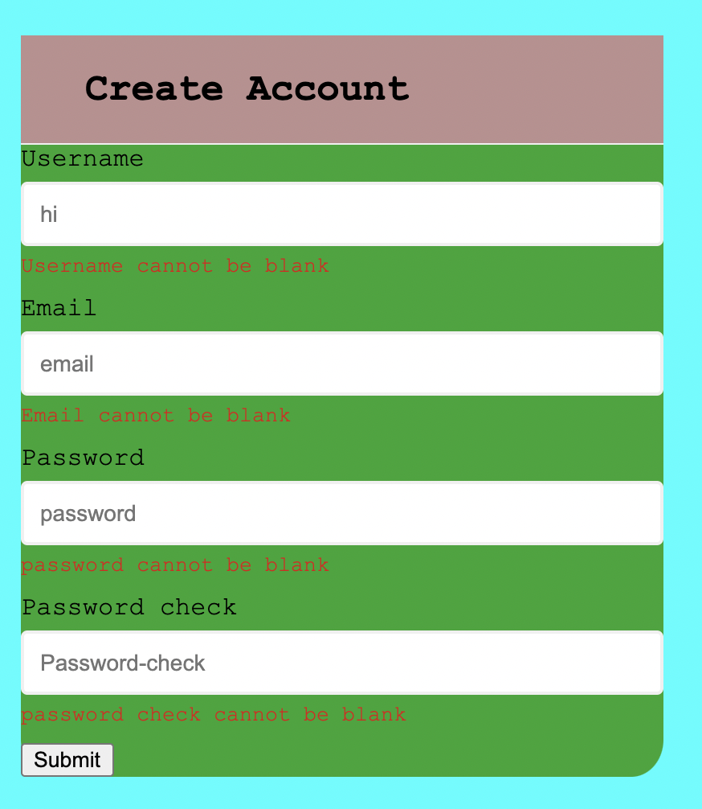
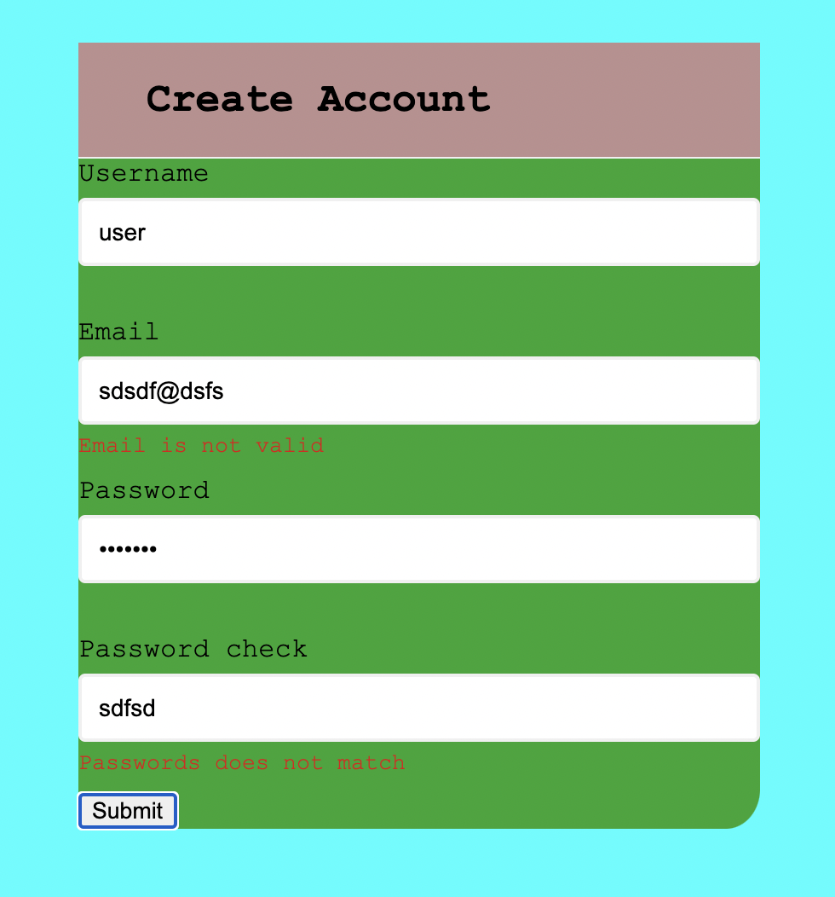

### Follow building "form validation"
- I followed youtube video and build this form validation, i build css almost by my self i understand i have quite shitty hand in css  

- Above this is basic form

- This is error message

- Email and password have another error messages 

```js
const re = /^(([^<>()[\]\\.,;:\s@"]+(\.[^<>()[\]\\.,;:\s@"]+)*)|(".+"))@((\[[0-9]{1,3}\.[0-9]{1,3}\.[0-9]{1,3}\.[0-9]{1,3}\])|(([a-zA-Z\-0-9]+\.)+[a-zA-Z]{2,}))$/;
    return re.test(String(email).toLowerCase());
```
this is RegExp for Email. i just coppied from somewhere. i'm  gonna explain about this tomorrow 

It was just imitation but imitation is the mother of creation
>link: https://www.youtube.com/watch?v=rsd4FNGTRBw