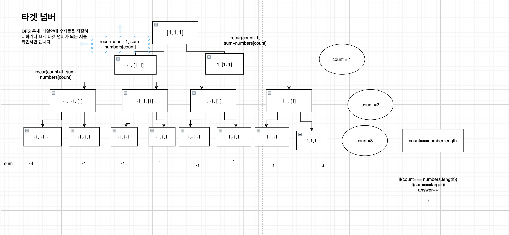

### DFS를 이용하는 문제로 주어진 배열안의 숫자들을 더하거나 빼서 타겟넘버가 되는 경우의 수를 구하는 것입니다. [1,1,1,1,1] 이 주어지면 같은 1이라고 해도 인덱스가 다르니 다른 수로 취급해서 다섯개의 1에 각자 -를 부여하면 3이 될 수 있는 경우의 수는 총 5가지입니다.
```js
function solution(numbers, target){
    let result=0 
    
    const dfs =(deepth, sum)=>{ // 재귀함수로 트리구조를 만들면서
                            //가장 아래 노드 leaf node에 도착하면 결과값을 +1 해주고 리턴한다. 
        if(deepth===numbers.length){ // leaf node에 도착
            if(sum===target){   // sum이 target 넘버와 같으면 
                result++        // 결과값 +1
            }
            return;
        }else{
            dfs(deepth+1, sum-numbers[deepth]) //왼쪽노드 배열의 요소를 -로 바꾸고 시작
            dfs(deepth+1, sum+numbers[deepth])// 오른쪽 노드는 +로 시작
        }
        
    }
    dfs(0, 0) // 첫번째는 계층을 두번째는 요소들의 합을 뜻함
    return answer
}
```
    그래프 형태로 정리한 내용 스스로 이해하기 쉬웠다. 
