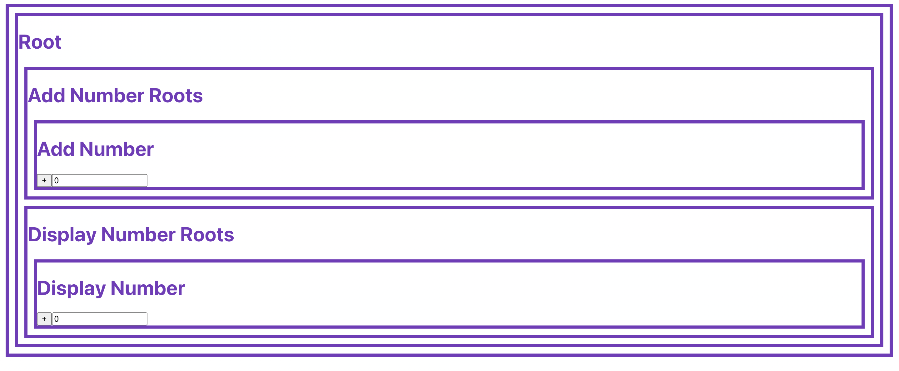

### 공식문서에 따르면 Redux는 자바스크립트 앱을 위한 예측 가능한 상태 컨테이너 라고 한다.
* 블로그에 따르면(https://m.blog.naver.com/wj8606/221843221092) 
"redux는 react에서 많이 사용되는 상태과리를 위한 라이브러리라고 볼 수 있다. 즉 리액트 이외에서도 사용할 수 있지만 redux와 react-redux의 npm 다운로드를 비교했을 때 아마도 react 상태관리를 위한 도구로 가장 많이 사용되는 것으로 추정된다."고 한다. 

- 네이버:https://d2.naver.com/helloworld/1848131
React는 Facebook에서 만든 자바스크립트 라이브러리입니다. react만 사용해도 애플리케이션을 개발할 수 있지만 그 규모가 커지고 구조가 조금이라도 복잡해지면 컴포넌트의 상태를 관리하는 일이 귀찮은 일이 됩니다. 그래서 많은 프로젝트에서 Redux를 함께 사용해 상태를 단순하게 처리합니다. 
---
많은 사이트들이 있지만 나는 유튜브에 있는 생활코딩 동여상을 보며 시작하기로 했다.
- 단순하게 말하면 react와 redux 모두 개발의 복자성을 낮추어 주는 도구이다. 
- react는 소문과 같고 redux는 미디어와 같다. 더 체계적이고 효율적이다. 
- 너무 많아지는 컴포넌트 관리의 어려움 때문에 redux를 사용한다. 
- time traveling 기능으로 데이터를 한눈에 보며 관리할 수 있다. 

본격적으로 redux를 배우기 전에 비교를 위해 react를 만들어 보았다.
```js
import React, {Component} from "react"
import styled from "styled-components";
import "./App.css";
import AddNumberRoot from "./Components/AddNumberRoot"
import DisplayNumberRoot from "./Components/DisplayNumberRoot"

function App() {
  return (
   <div className="App">
     <h1>Root</h1>
     <AddNumberRoot></AddNumberRoot>
     <DisplayNumberRoot></DisplayNumberRoot>
   </div>
    
  );
}


export default App;

```
